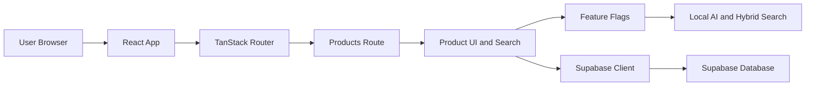

# SkyLaunch Architecture

The browser loads the React app, which uses TanStack Router to render the products route. The product UI reads feature flags to hide local-only AI search in production and sends data requests through the Supabase client to the database.